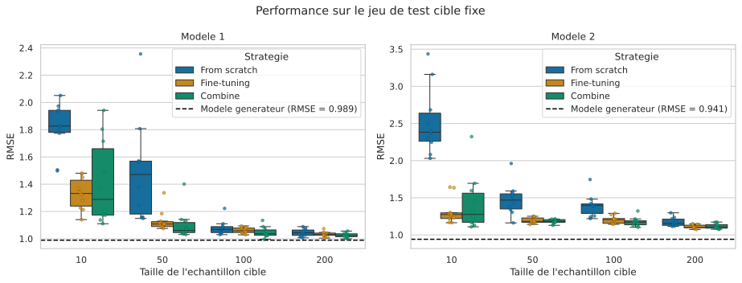

# Transfert d'apprentissage par fine-tuning en régression

Ce dépôt contient une expérience reproductible évaluant l'intérêt du **fine-tuning** pour transférer un réseau de neurones d'un domaine source vers un domaine cible. Deux mécanismes de régression simulés sont étudiés : un premier avec des effets simples et un second comportant des interactions plus complexes.

Trois stratégies sont comparées lorsque peu d'observations cibles sont disponibles :

- **fine-tuning** d'un MLP préentraîné sur le domaine source ;
- apprentissage sur le domaine cible uniquement (**from scratch**) ;
- apprentissage sur les données source et cible réunies (**combined**).

## Résultats



[Ouvrir la figure des résultats en PDF](figures/rmse_boxplots.pdf)

Chaque boxplot résume dix répétitions indépendantes. Les points représentent les RMSE individuelles sur un jeu de test cible fixe. La ligne horizontale pointillée donne la RMSE du modèle générateur exact sur ce même jeu de test.

Les résultats mettent principalement en évidence l'intérêt du transfert pour les plus petits échantillons cibles. L'écart entre les stratégies diminue ensuite lorsque davantage de données cibles sont disponibles. Le second mécanisme générateur, plus complexe, conserve une erreur légèrement plus élevée.

## Protocole expérimental

Chaque jeu simulé contient 2 000 observations réparties entre un domaine source et un domaine cible. Le domaine cible est séparé en un jeu de test fixe de 500 observations et un réservoir d'apprentissage de 500 observations. Des échantillons cibles emboîtés de tailles 10, 50, 100, 200 et 500 sont tirés à chacune des dix répétitions.

Le prédicteur est un MLP PyTorch utilisant des embeddings pour les variables catégorielles. Tous les entraînements utilisent un arrêt anticipé fondé sur un jeu de validation. Les trois stratégies partagent les mêmes échantillons d'apprentissage, de validation et de test afin de permettre une comparaison directe.

Le protocole complet, les modèles générateurs et les hyperparamètres sont détaillés dans [protocole.md](protocole.md).

## Installation

Le projet utilise Python 3.12. Il est conseillé de travailler dans un environnement virtuel :

```bash
python -m venv .venv
source .venv/bin/activate
pip install -r requirements.txt
```

## Reproduire l'expérience

Depuis la racine du dépôt :

```bash
# 1. Simuler les deux jeux de données
python simulate_data.py

# 2. Entraîner et évaluer les modèles
python run_experiment.py --device auto

# 3. Produire les figures
python visualize_results.py
```

L'option `--device auto` utilise CUDA lorsqu'il est disponible et se replie sinon sur le CPU. Pour imposer un calcul GPU, utiliser `--device cuda`.

Un test rapide de la chaîne de calcul peut être lancé avec :

```bash
python run_experiment.py \
  --device auto \
  --repetitions 1 \
  --max-epochs 2 \
  --patience 1 \
  --output-dir results_smoke
```

## Fichiers produits

- `data/model_1.csv` et `data/model_2.csv` : données simulées ;
- `results/rmse_results.csv` : RMSE des réseaux et du modèle générateur ;
- `results/splits.json` : indices des découpages et statistiques de standardisation ;
- `results/run_metadata.json` : versions, matériel, graines et arguments d'exécution ;
- `figures/rmse_boxplots.pdf` : figure principale au format PDF.

Les données et résultats intermédiaires ne sont pas versionnés, car ils peuvent être entièrement régénérés à partir des scripts et des graines enregistrées.

## Organisation du dépôt

```text
simulate_data.py       Simulation des deux jeux de données
run_experiment.py      Entraînement, évaluation et sauvegarde des résultats
visualize_results.py   Création des figures
protocole.md           Description détaillée du protocole expérimental
requirements.txt       Dépendances Python
```
